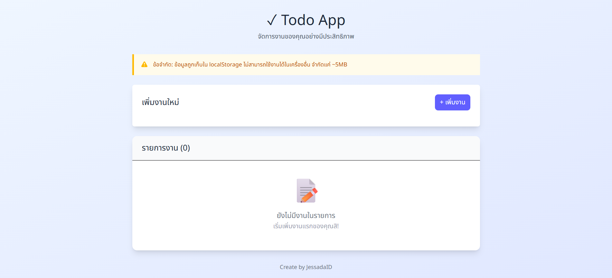

# 📋 TodoApp
แอปพลิเคชันจัดการงาน (Todo App) ที่พัฒนาด้วย React และ Vite เพื่อช่วยให้ผู้ใช้สามารถเพิ่ม ลบ และทำเครื่องหมายว่างานเสร็จสิ้นได้อย่างง่ายดาย โดยข้อมูลจะถูกเก็บไว้ใน localStorage ของเบราว์เซอร์ เพื่อให้สามารถเข้าถึงได้แม้หลังจากรีเฟรชหน้าเว็บ

## 🚀 คุณสมบัติ
  * เพิ่มงานใหม่พร้อมคำอธิบาย
  
  * ทำเครื่องหมายว่างานเสร็จสิ้นหรือยังไม่เสร็จ
  
  * ลบงานที่ไม่ต้องการ
  
  * ข้อมูลถูกเก็บไว้ใน localStorage เพื่อความคงอยู่ระหว่างการใช้งาน
  

## 🛠️ เทคโนโลยีที่ใช้
  * React
  
  * Vite
  
  * Tailwind CSS (สำหรับการตกแต่ง UI)
  
  * localStorage (สำหรับการเก็บข้อมูลฝั่งไคลเอนต์)

## Preview



## DEMO 
[TodoApp](https://jessadaid.github.io/TodoApp/)

### 📦 การติดตั้งและการใช้งาน
1. โคลนโปรเจกต์:

```bash
git clone https://github.com/JessadaID/TodoApp.git
cd TodoApp
```

2. ติดตั้งแพ็กเกจที่จำเป็น:
```bash
npm install
```

3. เริ่มต้นเซิร์ฟเวอร์สำหรับการพัฒนา:
```bash
npm run dev
```

จากนั้นเปิดเบราว์เซอร์และไปที่ http://localhost:5173 เพื่อดูแอปพลิเคชัน

## 📁 โครงสร้างโปรเจกต์

```pgsql
TodoApp/
├── public/
│   └── favicon.ico
├── src/
│   ├── App.css
│   ├── App.jsx
│   └── main.jsx
├── index.html
├── package.json
├── vite.config.js
└── README.md
```

## ⚠️ ข้อจำกัดของ localStorage
ขนาดข้อมูลจำกัด: localStorage มีข้อจำกัดด้านขนาด (ประมาณ 5MB) ซึ่งอาจไม่เพียงพอสำหรับแอปพลิเคชันที่ต้องการเก็บข้อมูลจำนวนมาก

ไม่ปลอดภัย: ข้อมูลใน localStorage สามารถถูกเข้าถึงและแก้ไขได้จาก JavaScript ฝั่งไคลเอนต์

ไม่สามารถแชร์ระหว่างผู้ใช้ได้: ข้อมูลถูกเก็บไว้ในเบราว์เซอร์ของผู้ใช้แต่ละคน ไม่สามารถซิงค์ระหว่างอุปกรณ์หรือผู้ใช้ได้


สำหรับแอปพลิเคชันที่ต้องการความปลอดภัยและการซิงค์ข้อมูลระหว่างอุปกรณ์ ควรพิจารณาใช้ฐานข้อมูลฝั่งเซิร์ฟเวอร์ เช่น Firebase หรือ MongoDB
